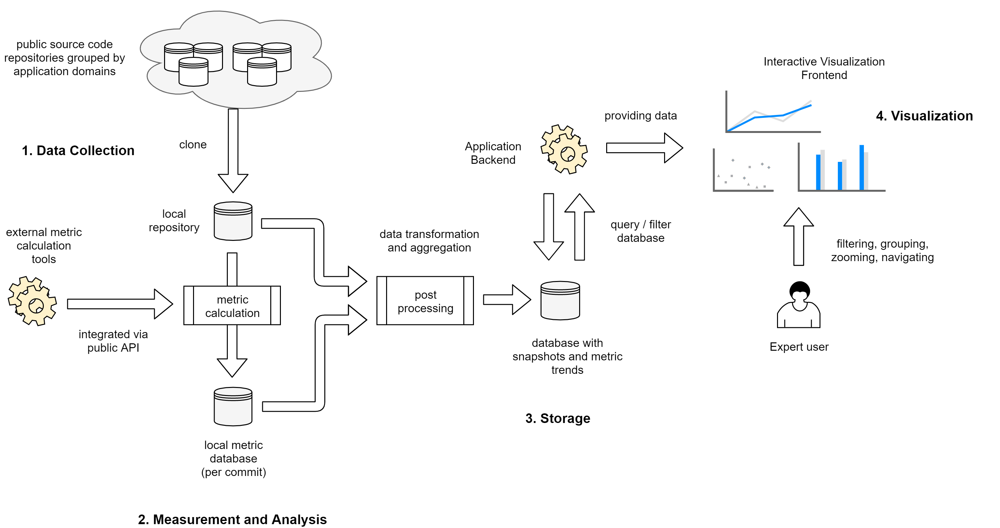
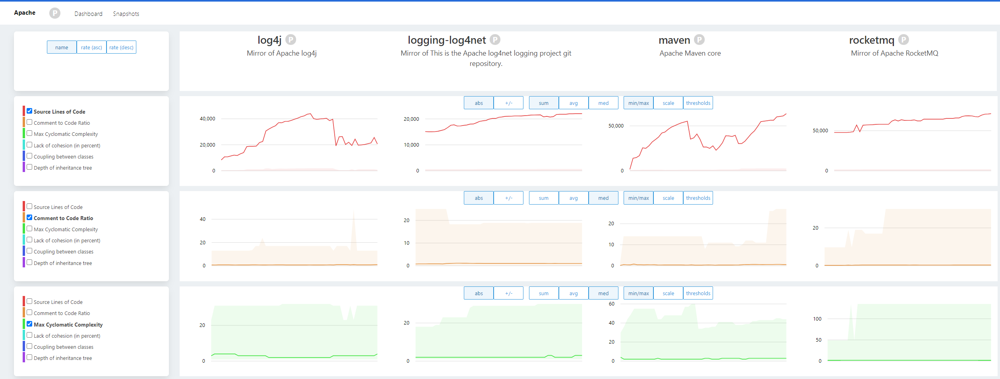

*portfoliotrix* is a prototype application for gathering, visualizing and analyzing software quality metrics on portfolio level. 

The application consists of three different parts:

## ArangoDB database backend

An ArangoDB graph database is used as data storage. The latest ArangoBD binaries can be found on the [ArangoDB homepage](https://www.arangodb.com/download/).

### Configuration

 The database uses the default configuration (stored in `repository-miner/db_config.py`)

```python
 URL = 'http://127.0.0.1:8529'
 USER = 'root'
 PASSWORD = ''
 DB_NAME = 'thesis'
```

All database tables will be created on startup by the Repository Miner toolchain. 
An example DB instance is also available through the later mentioned Docker file.

## Repository Miner

A command line data mining application that calculates quality metrics (by using [Understand](https://www.scitools.com/)) from Git repositories and stores aggregated metric values in an ArangoDB graph database. The workflow of the mining process is described by the following diagram:



### Configuration

The *Repository Miner* has the following configuration files:

**metric_config.py**

Contains a list of all available metrics and their description. Additionally, every metric description must provide a unique metric key that depends on the used metric provider. The current metric descriptions are taken from *Understand's* [documentation](https://support.scitools.com/t/what-metrics-does-undertand-have/66).

Example:

```python
class METRICS:
	ITEMS = [Metric('CountLineCode',
           		'Source Lines of Code',
           		'Additional description of the metric.'),
         	 Metric('RatioCommentToCode',
	            'Comment to Code Ratio',
    	        'Additional description of metric')]
```

**portfolio_config.py**

List of software repositories that are grouped together in the software portfolio. For every repository, its Github Repository name must be provided.

```python
class PORTFOLIOS:
    ITEMS = [
        Portfolio('Apache', 'Selection from Apache Software Foundation', [
            'apache/logging-log4net',
            'apache/log4j',
            'apache/maven',
            'apache/rocketmq'])]
```

**repository_config.py**

Repository specific configuration options to clone the Git repositories into the local file system.

```python
class REPOSITORY:
    DOWNLOAD_FOLDER = '../repositories' # local folder for repositories
    CLEAR_DOWNLOAD_FOLDER = True # if true, repositories will be redownloaded during startup
    GITHUB_TOKEN = '<your Github access token>'
    TOTAL_SNAPSHOT_SAMPLE_COUNT = 50 # number of commit samples that will be taken for analysis
```

**Important**: Please regard that *Understand from Scitools* is an external commercial tool that is not part of this repository and requires an additional license. *Understand* can be downloaded from this [link](https://licensing.scitools.com/download), and a student/non-commercial license can be requested through this [form](https://licensing.scitools.com/login). Information for setting up the correct path and directory information to integrate *Understand* with the Repository Mining toolchain can be found in the repository's mining [readme](./repository-miner/readme.txt).

## Visualization

The visualization module uses a REST-API based backend (Python Flask) and an Angular frontend for the user interaction.



## Docker

This repository contains a docker compose [file](./visualization/docker-compose.yml) that can be started by using the command

```shell
docker-compose up
```

The command will start three docker containers, one for the ArangoDB, one for the visualization backend and an nginx webserver which hosts the visualization frontend. The database container provides also an example database that already contains some metrics collected from selected Apache projects.

After starting the Docker containers  the application's dashboard should be available by opening a browser at the location `http://localhost:8080`.